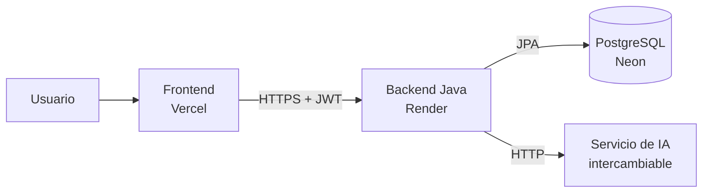

# Render.IA — Backend

API REST de **Render.IA**, una plataforma que usa inteligencia artificial para convertir planos 2D en modelos estructurales 3D.

Proyecto final de **Patrones de Software** — Universidad Cooperativa de Colombia, sede Pasto.

- **Integrantes:** Juan David Moreno, Felipe Cerón
- **API en producción:** https://renderia-backend.onrender.com/api/v1/hello
- **Frontend:** https://renderia-frontend.vercel.app ([repositorio](https://github.com/Render-ia/renderia-frontend))
- **Base de datos:** [renderia-database](https://github.com/Render-ia/renderia-database) (PostgreSQL en Neon, con el DER)

## Arquitectura



El usuario usa el frontend, el frontend llama a esta API, la API guarda y lee en PostgreSQL y le pide el análisis de los planos al componente de IA. El modelo de IA se elige desde la tabla `ai_models`, así que se puede cambiar sin tocar el frontend, el backend ni la base de datos.

## Tecnologías

| Parte | Herramienta |
|---|---|
| Lenguaje | Java 21 |
| Framework | Spring Boot 4 (Web MVC, Data JPA, Security) |
| Base de datos | PostgreSQL 16 en Neon |
| Autenticación | JWT firmado con HS256 y contraseñas cifradas con BCrypt |
| Contenedor | Docker (imagen multi-etapa) |
| CI/CD | GitHub Actions: compila, prueba, construye la imagen y despliega en Render |

## Endpoints

Todas las rutas empiezan por `/api/v1`. El contrato completo que usa el frontend está en [`docs/API.md`](https://github.com/Render-ia/renderia-frontend/blob/main/docs/API.md).

| Método | Ruta | Acceso | Descripción |
|---|---|---|---|
| GET | `/hello` | Público | Nombre del proyecto e integrantes |
| GET | `/health` | Público | Estado del servidor y de la base de datos |
| POST | `/auth/register` | Público | Crea una cuenta (Ingeniero o Estudiante) |
| POST | `/auth/login` | Público | Devuelve el token de sesión |
| GET | `/auth/me` | Con token | Usuario de la sesión actual |
| GET | `/roles` | Público | Roles disponibles |
| GET | `/building-types`, `/element-types`, `/materials` | Público | Catálogos |
| POST, PUT, DELETE | `/building-types`, `/element-types`, `/materials` | Administrador | Editar catálogos |
| GET | `/ai-models` | Público | Modelos de IA disponibles |
| PUT | `/ai-models/{id}` | Administrador | Activar un modelo o elegir el predeterminado |

Los errores responden con el código HTTP adecuado y un cuerpo `{ "message": "..." }` en español.

## Patrones de diseño

| Patrón | Dónde | Para qué |
|---|---|---|
| **Template Method** | `CatalogService` | Listar, crear, editar y borrar siguen los mismos pasos en los tres catálogos; cada subclase solo define su entidad y su nombre |
| **Singleton** | Servicios y configuración (`@Service`, `@Configuration`) | Spring crea una sola instancia de cada uno y la comparte |
| **Repository** | `repository/*` | Separa el acceso a datos de la lógica de negocio |
| **DTO** | `dto/*` | Lo que viaja por la API no expone las entidades (por ejemplo, nunca sale la contraseña) |
| **Facade** | `AuthService` | Una sola llamada esconde validar, cifrar, guardar y generar el token |

## Estructura

```
src/main/java/com/renderia/renderia_backend/
├── config/       CORS y cuenta de administrador inicial
├── controller/   Rutas REST
├── dto/          Objetos de petición y respuesta
├── exception/    Errores con mensajes en español
├── model/        Entidades JPA (tablas de schema.sql)
├── repository/   Acceso a datos con Spring Data JPA
├── security/     JWT y reglas de acceso
└── service/      Lógica de negocio
```

## Variables de entorno

Ninguna clave se guarda en el repositorio. En Render se configuran estas variables:

| Variable | Para qué |
|---|---|
| `DB_URL` | Conexión JDBC a Neon (`jdbc:postgresql://.../neondb?sslmode=require`) |
| `DB_USERNAME`, `DB_PASSWORD` | Credenciales de la base de datos |
| `JWT_SECRET` | Clave para firmar los tokens (mínimo 32 caracteres) |
| `ADMIN_EMAIL`, `ADMIN_PASSWORD` | Crean la primera cuenta de administrador al arrancar |
| `FRONTEND_URL` | Dominios con permiso CORS (opcional; por defecto Vercel y `localhost:5173`) |

## Cómo ejecutarlo

Requiere Java 21 y una base PostgreSQL con las tablas de `renderia-database`.

```bash
# Windows (PowerShell)
$env:DB_URL="jdbc:postgresql://localhost:5432/renderia"
$env:DB_USERNAME="postgres"
$env:DB_PASSWORD="postgres"
.\mvnw spring-boot:run
```

La API queda en `http://localhost:8080/api/v1/hello`.

## Despliegue

Cada push a `main` corre el flujo de GitHub Actions (`.github/workflows/ci.yml`):

1. Compila y corre las pruebas.
2. Construye la imagen de Docker.
3. Si todo pasa, avisa a Render con un Deploy Hook (secreto `RENDER_DEPLOY_HOOK`) y Render publica la nueva versión.
